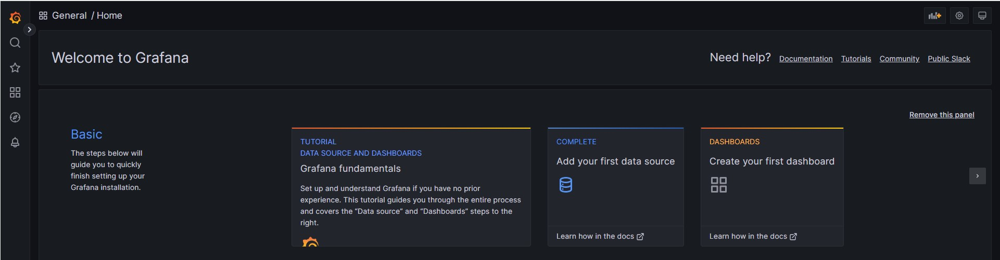
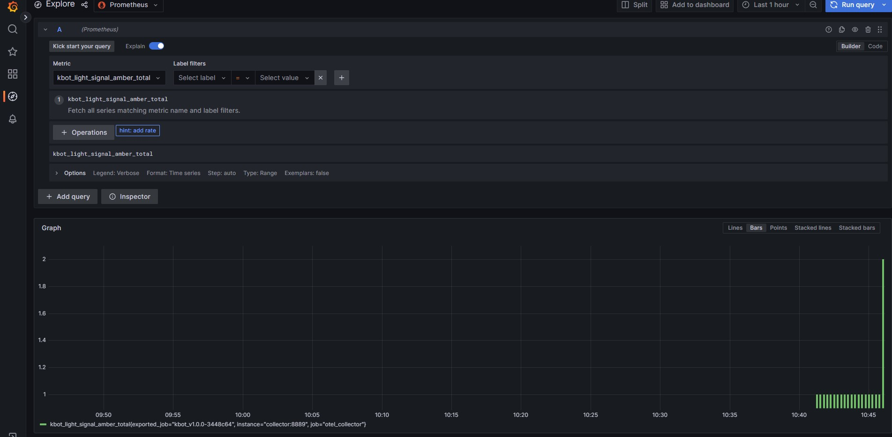
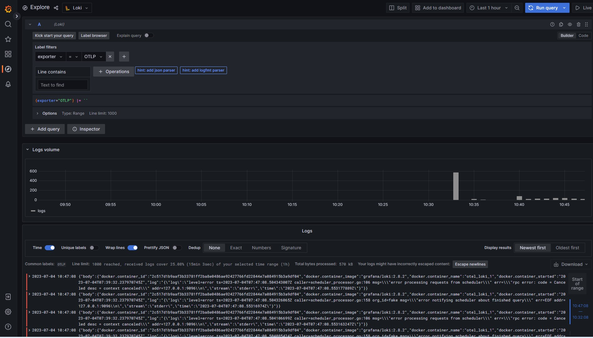

# Open-telemetry observability

Sample configuration for Kbot that send logs to [OpenTelemetry Collector] and metrics to [OpenTelemetry Collector] or [Prometheus].

## Prerequisites

- [Docker]
- [Docker Compose]

## How to run

```bash
export TELE_TOKEN=<TOKEN>
docker-compose up
```

## Grafana demo

**This task was completed on junior level because of time restriction. Migration from docker-compose to Kubernetes will be done by my own later.

Grafana start page


Prometeus metrics



Loki logs


