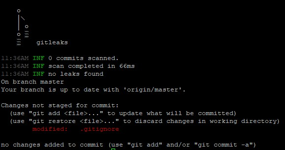

# Gitleaks script

------------
**Requirements**

python3.10 and curl

------------
**Install procedure**

At the git project directory run:

```sh
curl -sSL  https://raw.githubusercontent.com/vidovgopol/kbot/master/scripts/gitleaks_install.sh  | sh
```

This command will add pre-commit script to .git/hooks directory and edit .gitignore file for ignoring gitleaks directory

When you execute git commit , gitleaks will be downloaded and installing into your project automatically.

Also you need to enable gitleaks pre-commit hook:
```sh
git config hooks.gitleaks enable
```
------------

**Execution example**


